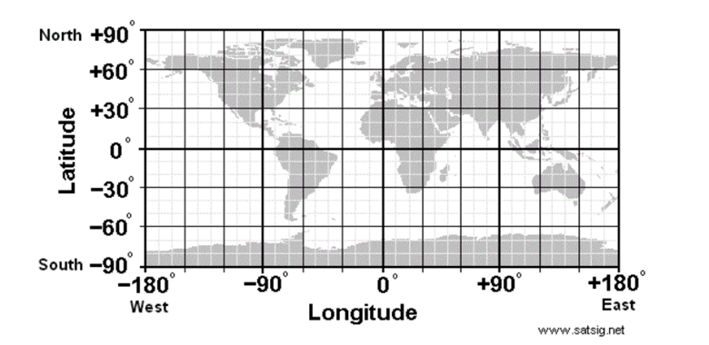

# Flood Analysis Automation Tool (QGIS + GRASS)

## Overview

This tool uses QGIS and GRASS to delineate a watershed, extract streams, and produce a flood risk map.

Using a user-provided DEM, the tool:
- Delineates a watershed based on outlet coordinates  
- Extracts streams based on user-defined thresholds  

It then computes six geomorphic parameters:

- Topographic Wetness Index (TWI)  
- Height Above Nearest Drainage (HAND)  
- Drainage Density  
- Runoff Coefficient  
- Soil Transmissivity  
- Basin Shape Factor (Kc)  

These are combined linearly to estimate the relative geomorphic susceptibility of each subbasin.

Using:
- CHIRPS rainfall data → rainfall forcing  
- ESA landcover → exposure  

The tool produces a flood risk map where subbasins spatially grid the watershed area.

Additionally:
- Strahler order is computed for the extracted stream network  
- Flood regime (hillslope vs riverine) is approximated using relative contributions of the six factors  

---

## Software Requirements

- QGIS Desktop 3.40.14 or higher  
  https://download.qgis.org/downloads/QGIS-OSGeo4W-4.0.0-1.msi  
  (Ensure GRASS plugins are enabled)

- GRASS GIS 8.4.2 or higher  
  https://grass.osgeo.org/download/  
  Required extensions:
  - r.stream.order  
  - r.stream.distance  

  Install via:  
  Settings → Addons Extensions → Install extension from addons  

- Miniconda3  
  https://repo.anaconda.com/miniconda/Miniconda3-latest-Windows-x86_64.exe  

---

## Initial Setup (Required)

There are two parts to the initial setup:
1. Download CHIRPS rainfall data  
2. Set up the Conda environment  

These steps only need to be completed once.

---

## CHIRPS Rainfall Data (NetCDF)

### CHIRPS V3.0
- Coverage: -60° to +60° latitude  
- Time: 2001 onwards  
- Size: ~32GB per 10 years  

Recommended only if analyzing regions outside -50° to +50° latitude.

Download options:
- Use script: Chirps_downloader_V3.py  
- Manual download:  
  https://data.chc.ucsb.edu/products/CHIRPS/v3.0/daily/final/sat/netcdf/byMonth/  

---

### CHIRPS V2.0 (Recommended)
- Coverage: -50° to +50° latitude  
- Time: 1981 onwards  
- Size: ~12GB per 10 years  

Recommended for most use cases.

Download options:
- Use script: Chirps_downloader_V2.py  
- Manual download:  
  https://data.chc.ucsb.edu/products/CHIRPS-2.0/global_daily/netcdf/p05/  

If downloading manually, ensure all files are stored in a single folder.



---

### Step-by-step Instructions

1. Install Miniconda (if not already installed)  
   Download and install from:  
   https://repo.anaconda.com/miniconda/Miniconda3-latest-Windows-x86_64.exe  

2. Open **Anaconda Prompt**  
   (Search for "Anaconda Prompt" in the Windows search bar)

3. Navigate to the `Initial_setup` folder  
   Replace the path below with the location where you downloaded the project:

   ```bash
   cd "C:\Users\YourUsername\Downloads\Flood_Tool\Initial_setup"
   ```

   ✅ Tip:  
   - You can copy the folder path from File Explorer and paste it here  
   - Make sure the folder contains `flood_env.yaml`

4. Create the environment

   ```bash
   conda env create -f flood_env.yaml
   ```

   This may take a few minutes as dependencies are installed.

5. Activate the environment

   ```bash
   conda activate flood_env
   ```

6. Locate the Python executable

   ```bash
   where python
   ```

   You should see a path similar to:

   ```
   C:\Users\YourUsername\miniconda3\envs\flood_env\python.exe
   ```

7. Copy this path

   This path is required as input in the main script:
   ```
   conda_python_path
   ```

---

---

## How to Use

1. Open QGIS  
2. Open the Python Console (Ctrl + Alt + P)  
3. Load and run the script `Flood_tool_done.py`  

You will be required to provide:
- DEM file  
- Projected CRS  
- Watershed outlet coordinates  
- Path to Conda Python environment  
- Path to CHIRPS data folder  

Detailed instructions are provided within the script.

---

## Unique Features

- Multi-threshold processing  
  Allows analysis of both large-scale trends (higher thresholds) and fine detail (lower thresholds)

- Automatic outlet snapping  
  User-defined outlet coordinates are snapped to the nearest stream  
  (May occasionally fail)

- Flood regime approximation  
  Uses hillslope contribution to distinguish between riverine and hillslope-driven flooding  

---

## References

- https://www.sciencedirect.com/science/article/abs/pii/S0169809519314073  
- https://esa-worldcover.org/en  
- https://www.chc.ucsb.edu/data/chirps3  
- https://agupubs.onlinelibrary.wiley.com/doi/full/10.1029/2020MS002242  
- https://doi.org/10.3334/ORNLDAAC/1304  

QGIS for Hydrological Applications (Second Edition)  
Hans van der Kwast and Kurt Menke
